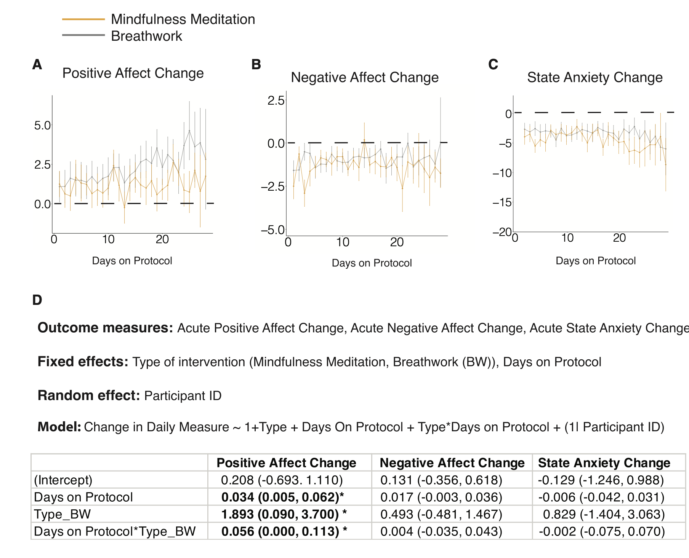

```{r setup, include=FALSE}
knitr::opts_chunk$set(echo = TRUE)
```

# Introduction

In this paper, which is published in the journal Cell Reports Medicine (Impact Factor 11.97), the main claim made is stated in the abstract:

> we show that breathwork, especially the exhale-focused cyclic sighing, produces greater improvement in mood ($p < 0.05$) and reduction in respiratory rate ($p < 0.05$) compared with mindfulness meditation

The authors provide the data (no code), or at least claim to provide the data that resulted in the paper (see details below).

I attempted to reproduce the analyses reported in their paper.

## Summary of main findings

- I cannot reproduce a key claim in this paper (Figure 3), that cyclic sighing improves positive feelings compared to mindfulness meditation.
- Surprisingly, from the Excel file it seems that about half the data consists of subjects who did not even do the exercise they were assigned. It seems the authors just included these cases, even if the key breathing or meditation task was not even carried out.
- Including a predictor that indicates whether the participant did the task or not has no impact on the outcome.
- A key interaction reported in Figure 3 cannot be significant (it even has two stars), because the reported confidence interval crosses zero. 

I suspect that the data provided is not the data used in the published analysis.

I think it is likely that this entire analysis is bogus and in my opinion, this paper should be retracted.

Obviously, the claim itself makes sense: breathing reduces stress; I know this from personal experience with breathing exercises.  But there is almost no evidence for this claim in the paper.

It's pretty odd that a high-impact journal like Cell Reports Medicine would publish such shoddy work. It is clear that the reviewers did not notice the statistically impossible interaction in Figure 3.

# What the original paper was about

The paper, published on Jan 17 2023,  is titled

*Brief structured respiration practices enhance mood and reduce physiological arousal*

and evaluates through an internet-based study the effect of breathwork compared to mindfulness meditation on several different self-perceived well-being metrics.

The paper is available from: 
https://doi.org/10.1016/j.xcrm.2022.100895

It is open access and the data used in the paper are purportedly available (more on this below).

Mindfulness meditation (hereafter, MM) is compared to three other methods:

- cyclic sighing (CS), ``which emphasizes prolonged exhalations''
- box breathing (BB), ``which is equal duration of inhalations, breath retentions, and exhalations''
- cyclic hyperventilation (CH) ``with retention, with longer inhalations and shorter exhalations''

## Methods

114 participants, with the following between-subjects partitioning:

- MM: 24 (in the data provided, I see 25, or 23 if we remove the ones who didn't do the task)
- CS: 30 (in the data provided, I see 31, or 29 if we remove the ones who didn't do the task)
- BB: 21 (in the data provided, I see 22, or 21 if we remove the ones who didn't do the tasks)
- CH: 33 (in the data provided, I see 35, or 34 if we remove the ones who didn't do the tasks)

Dependent variables:

- positive affect (PANAS positive, range 10–50), 
- negative affect (PANAS negative, range 10–50), 
- state anxiety (State-Trait Anxiety Inventory [STAI], range 20–80) scores on each participant before and after each breathwork protocol daily.

The experiment was conducted over 29 days, so we have repeated measurements from each subject in each condition, but no repeated measures across the four conditions.


# The claims that I investigated

## Claims summarized in Figure 2

There are three dependent measures:

- Positive Affect Change (PANAS positive)
- Negative Affect Change (PANAS negative)
- State Anxiety Change (STAI)

There are three predictors:

- Days on protocol (Days 1-28)
- Type of Breathwork (Mindfulness meditation is the baseline, compared to breathwork, collapsing all three other conditions into one breathwork condition)
- The interaction between days and type.

Claims:

- The number of days of intervention increases PANAS positive.
- Breathwork leads to increased PANAS positive values.
- There is a significant interaction, such that PANAS positive increases more if breathwork is done rather than mindfulness meditation.

The authors write:

> the breathwork group had a notably higher increase in daily positive affect (Figures 2A and 2D). The breathwork group also had a significant interaction with the number of days on protocol, such that the daily positive affect increase was larger the more days subjects had been on the protocol (Figures 2A and 2D), suggesting an effect of adherence over time on the daily positive affect benefits.


## Claim summarized in Figure 3

One statistical claim I wanted to investigate is summarize in Figure 3 in the paper, and is explained as follows:

> We then examined if breathwork was more effective than mindfulness meditation in reducing anxiety and improving mood. To address this, we constructed a linear mixed-effects model with protocol type and ``number of days on protocol'' as the fixed effect and participants as the random effect predictors.


>  Using a mixed-effects model, we show that breathwork, especially the exhale-focused cyclic sighing, produces greater improvement in mood ($p < 0.05$) and reduction in respiratory rate ($p < 0.05$) compared with mindfulness meditation. Daily 5-min cyclic sighing has promise as an effective stress management exercise.

They also write this:

> 5 min per day of deliberate breathing practice can cause significant shifts in autonomic tone and well-being.


# Data preparation

## The data provided

The authors write:

> De-identified raw human physiology and survey
> data have been deposited at Dryad repository
> (https://datadryad.org/) and are publicly
> available as of the date of publication.
> Accession numbers are listed in the key
> resources table.
> All original code has been deposited at Zenodo
> and is publicly available as of the date of
> publication. DOIs are listed in the key
> resources table.
> Any additional information required to
> reanalyze the data reported in this paper is
> available from the lead contact upon request.


Some comments:

- they claim that "all original code" has been deposited at Zenodo. However, all they deposit there is the R preprocessing files, the crucial linear mixed modeling code was done in Matlab and is not provided (at least, I could not find it). No data is provided with the files and no README, so it was impossible for me to run the R code.
- They mention a lead contact for obtaining any missing information, and the phrase lead contact is hyper-linked, but the link doesn't lead to any name.
- The data are in an Excel file that is deposited in some other repository (dryad), not Zenodo, and is called:

BWPilot_CombinedData_20210803_fordryad_addvars_cleaned_noround2_v3.xlsx

The file name is a red flag for me and suggests that whoever prepared the file is  a beginner in data management. The file name itself lowers my confidence in this entire study. The file name also raises some questions: what was in versions 1 and 2, and what exactly does cleaned mean here?


## Data preprocessing

Read in the csv version of the Excel file:

```{r}
dat<-read.csv("BWPilot_CombinedData_20210803_fordryad_addvars_cleaned_noround2_v3.csv",
              sep=";",
              na.strings=".")
colnames(dat)
```

Isolate the first nine columns plus 11th column for the linear mixed models analyses.

```{r}
dat<-dat[,c(1:9,11)]
head(dat)
```

Rename the columms to more tractable names:

```{r}
colnames(dat)<-c("subj","days","exercise","PrePANASPos",
                 "PrePANASNeg","PostPANASPos","PostPANASNeg",
                 "PreSTAI","PostSTAI","completed")
head(dat)
```

Remove all irrelevant days:

```{r}
dat<-subset(dat,days>0 & days < 29)
head(dat)
```

Sanity check:

```{r}
length(unique(dat$subj))
```

One subject seems to be missing: the authors wrote they had 114 subjects.

Convert the treatments to factors:

```{r}
dat$exercise<-factor(dat$exercise)
```

The authors write that the names for the exercises in the data file do not correspond to the names used in the paper:

> Round 1 Exercise: Participant’s assigned
> intervention. Note the nomenclature is slightly
> different than the manuscript. Super
> Oxygenation = Cyclic Hyperventilation with
> Retention. Slow Breathing = Cyclic Sighing

We will therefore rename the conditions from those in the data file to those in the paper:

```{r}
dat$exercise<-factor(dat$exercise,
                     levels=c("Mindful Meditation",
                              "Box Breathing",
                              "Slow Breathing",
                              "Super Oxygenation"))

dat$cond<-ifelse(dat$exercise=="Mindful Meditation",
                 "MM",
       ifelse(dat$exercise=="Box Breathing",
              "BB",
              ifelse(dat$exercise=="Slow Breathing",
                     "CS",
                     ifelse(dat$exercise=="Super Oxygenation",
                            "CH",NA))))
```

Next, set the factor levels so that the baseline condition is MM (Mindfulness Meditation), because this is compared to the other three conditions in Figures 2 and 3:

```{r}
dat$cond<-factor(dat$cond,levels=c("MM","CS","BB","CH"))
contrasts(dat$cond)
```

For Figure 2, in which MM is compared to the other three conditions taken as one group, we create a new centered factor called BvsMM. Here, MM is coded -1/2 and all other conditions 1/2.

```{r}
dat$BvsMM<-ifelse(dat$cond=="MM",-1/2,1/2)
```

The number of subjects in each condition:

```{r}
length(unique(subset(dat,cond=="MM")$subj))
length(unique(subset(dat,cond=="CS")$subj))
length(unique(subset(dat,cond=="BB")$subj))
length(unique(subset(dat,cond=="CH")$subj))

```

Next, set up the dependent variables for  Figures 2 and 3:

```{r}
## create dependent variables:
dat$PANASpos<-dat$PostPANASPos-dat$PrePANASPos
dat$PANASneg<-dat$PostPANASNeg-dat$PrePANASNeg
dat$STAI <- dat$PostSTAI-dat$PreSTAI
```

Graphical visualization of the dependent variables:

```{r histograms,fig.cap="The distribution of the three dependent variables."}
op<-par(mfrow=c(1,3),pty="s")
hist(dat$PANASpos,main="PANAS positive")
hist(dat$PANASneg,main="PANAS negative")
hist(dat$STAI,main="STAI")
```

Next, check the structure of the data:

The key manipulation is between subjects:

```{r}
xtabs(~subj+cond,dat)
```

We have at most one data point per day (some missing data):

```{r}
xtabs(~subj+days,dat)
```
## An oddity: Subjects did the task only in about 50% of the cases

The paper states:

> During the 28-day intervention period,
> participants did their assigned 5-min exercise
> and completed two questionnaires before and
> after, the State Anxiety Inventory60 and the
> Positive and Negative Affect Schedule (PANAS).

The paper also states:

> Participants were assumed to have completed the
> breathing protocol if they had filled out the
> pre- and post-measures for a particular day.

They don't mention in the paper that they explicitly asked the subjects whether they had completed the task.  It seems some subjects did not complete the task; in fact, some didn't do the task at all!:

```{r}
summary(dat$completed)
```

```{r}
completion_data<-xtabs(~subj+completed,dat)
NotCompleted<-colSums(completion_data)[1]
Completed<-colSums(completion_data)[2]
```

The percentage that reported that they didn't do the task:

```{r}
round(100*NotCompleted/(NotCompleted+Completed))
```

If we remove the data where the task was not completed, we would lose about 41% the data. 

However, if subjects did not do the task assigned, should they be included in the analysis? I would say no, but I will report linear mixed models both with and without these non-compliant subjects, because it seems that the authors ignored the fact that many subjects didn't even do the assigned task (they ignored the completed column).

Subset the data of the people who reported completing the key task:

```{r}
dat_completed<-subset(dat,completed==1)
```


The number of subjects in each condition after we remove subjects who didn't do the task:

```{r}
length(unique(subset(dat_completed,cond=="MM")$subj))
length(unique(subset(dat_completed,cond=="CS")$subj))
length(unique(subset(dat_completed,cond=="BB")$subj))
length(unique(subset(dat_completed,cond=="CH")$subj))
```

# My reanalyses of Figures 2 and 3

## Figure 2: approximate recreation


Here is their Figure 2:



\newpage

### Recreation of Figure 2 with all the data provided

The plots below are based on the full data, regardless  of whether subjects completed the task:

First, here is the plot for positive affect change for the two conditions:

```{r fig2recreation1,fig.cap="Approximate recreation of their Figure 2 (all the data, positive affect change)."}
op<-par(mfrow=c(1,2),pty="s")

dat$cond2<-factor(ifelse(dat$BvsMM==-0.5,"MM","Breathing"))

conditions<-levels(dat$cond2)

## PANAS pos:
# for each condition, make a plot:
for(j in 1:length(conditions)){
# First, aggregate the data:  
dat_agg<-with(subset(dat,cond2==conditions[j]),
              tapply(PANASpos,days,mean,na.rm=TRUE))

# Compute SD:
dat_agg_SD<-with(subset(dat,cond2==conditions[j]),
                 tapply(PANASpos,days,sd,na.rm=TRUE))
# figure out no. of data points in the condition being plotted:
lengths<-rep(NA,28)
for(i in 1:28){
lengths[i]<-dim(subset(dat,cond2==conditions[j] & days == i))[1]
}

# compute SE for plotting confidence intervals:
SE<-dat_agg_SD/sqrt(lengths)

datframe<-data.frame(y=dat_agg,
                     x=1:28,
                     lower=dat_agg-2*SE,
                     upper=dat_agg+2*SE)

plot(datframe$x,datframe$y,ylim=c(-3,max(datframe$y)+2),
     xlab="days",
     ylab="Positive Affect Change",
     main=conditions[j])
with(datframe,
arrows(x0=x,y0=lower,x1=x,y1=upper,angle=90,
       length=0)
)
abline(h=0)
}
```

Second, we look at negative affect change:


```{r fig2recreation2,fig.cap="Approximate recreation of their Figure 2 (all the data, negative affect change)."}
op<-par(mfrow=c(1,2),pty="s")

## PANAS neg:
# for each condition, make a plot:
for(j in 1:length(conditions)){
# First, aggregate the data:  
dat_agg<-with(subset(dat,cond2==conditions[j]),
              tapply(PANASneg,days,mean,na.rm=TRUE))

# Compute SD:
dat_agg_SD<-with(subset(dat,cond2==conditions[j]),
                 tapply(PANASneg,days,sd,na.rm=TRUE))
# figure out no. of data points in the condition being plotted:
lengths<-rep(NA,28)
for(i in 1:28){
lengths[i]<-dim(subset(dat,cond2==conditions[j] & days == i))[1]
}

# compute SE for plotting confidence intervals:
SE<-dat_agg_SD/sqrt(lengths)

datframe<-data.frame(y=dat_agg,
                     x=1:28,
                     lower=dat_agg-2*SE,
                     upper=dat_agg+2*SE)

plot(datframe$x,datframe$y,ylim=c(-3,max(datframe$y)+2),
     xlab="days",
     ylab="Negative Affect Change",
     main=conditions[j])
with(datframe,
arrows(x0=x,y0=lower,x1=x,y1=upper,angle=90,
       length=0)
)
abline(h=0)
}
```

Finally, we plot STAI:

```{r fig2recreation3,fig.cap="Approximate recreation of their Figure 2 (all the data, STAI)."}
op<-par(mfrow=c(1,2),pty="s")
## STAI:
# for each condition, make a plot:
for(j in 1:length(conditions)){
# First, aggregate the data:  
dat_agg<-with(subset(dat,cond2==conditions[j]),
              tapply(STAI,days,mean,na.rm=TRUE))

# Compute SD:
dat_agg_SD<-with(subset(dat,cond2==conditions[j]),
                 tapply(STAI,days,sd,na.rm=TRUE))
# figure out no. of data points in the condition being plotted:
lengths<-rep(NA,28)
for(i in 1:28){
lengths[i]<-dim(subset(dat,cond2==conditions[j] & days == i))[1]
}

# compute SE for plotting confidence intervals:
SE<-dat_agg_SD/sqrt(lengths)

datframe<-data.frame(y=dat_agg,
                     x=1:28,
                     lower=dat_agg-2*SE,
                     upper=dat_agg+2*SE)

plot(datframe$x,datframe$y,ylim=c(-8,max(datframe$y)+2),
     xlab="days",
     ylab="State anxiety change",
     main=conditions[j])
with(datframe,
arrows(x0=x,y0=lower,x1=x,y1=upper,angle=90,
       length=0)
)
abline(h=0)
}
```

### Recreation of Figure 2 with data from people who actually completed the task

Here is the plot for PANAS positive (the only dependent variable with significant effects reported) using only those data in which subjects actually did the task:

```{r fig2recreation1completed,fig.cap="Approximate recreation of their Figure 2 (only those who completed the task, Positive Affect change)."}
op<-par(mfrow=c(1,2),pty="s")

dat_completed$cond2<-factor(ifelse(dat_completed$BvsMM==-0.5,"MM","Breathing"))

conditions<-levels(dat_completed$cond2)

# for each condition, make a plot:
for(j in 1:length(conditions)){
# First, aggregate the data:  
dat_agg<-with(subset(dat_completed,cond2==conditions[j]),
              tapply(PANASpos,days,mean,na.rm=TRUE))

# Compute SD:
dat_agg_SD<-with(subset(dat_completed,cond2==conditions[j]),
                 tapply(PANASpos,days,sd,na.rm=TRUE))
# figure out no. of data points in the condition being plotted:
lengths<-rep(NA,28)
for(i in 1:28){
lengths[i]<-dim(subset(dat_completed,cond2==conditions[j] & days == i))[1]
}

# compute SE for plotting confidence intervals:
SE<-dat_agg_SD/sqrt(lengths)

datframe<-data.frame(y=dat_agg,
                     x=1:28,
                     lower=dat_agg-2*SE,
                     upper=dat_agg+2*SE)

plot(datframe$x,datframe$y,ylim=c(-3,max(datframe$y)+2),
     xlab="days",
     ylab="Positive Affect Change",
     main=conditions[j])
with(datframe,
arrows(x0=x,y0=lower,x1=x,y1=upper,angle=90,
       length=0)
)
abline(h=0)
}
```

Next, the negative affect change:

```{r fig2recreation2completed,fig.cap="Approximate recreation of their Figure 2 (only those who completed the task, Negative Affect change)."}
op<-par(mfrow=c(1,2),pty="s")

dat_completed$cond2<-factor(ifelse(dat_completed$BvsMM==-0.5,"MM","Breathing"))

conditions<-levels(dat_completed$cond2)

# for each condition, make a plot:
for(j in 1:length(conditions)){
# First, aggregate the data:  
dat_agg<-with(subset(dat_completed,cond2==conditions[j]),
              tapply(PANASneg,days,mean,na.rm=TRUE))

# Compute SD:
dat_agg_SD<-with(subset(dat_completed,cond2==conditions[j]),
                 tapply(PANASneg,days,sd,na.rm=TRUE))
# figure out no. of data points in the condition being plotted:
lengths<-rep(NA,28)
for(i in 1:28){
lengths[i]<-dim(subset(dat_completed,cond2==conditions[j] & days == i))[1]
}

# compute SE for plotting confidence intervals:
SE<-dat_agg_SD/sqrt(lengths)

datframe<-data.frame(y=dat_agg,
                     x=1:28,
                     lower=dat_agg-2*SE,
                     upper=dat_agg+2*SE)

plot(datframe$x,datframe$y,ylim=c(-3,max(datframe$y)+2),
     xlab="days",
     ylab="Negative Affect Change",
     main=conditions[j])
with(datframe,
arrows(x0=x,y0=lower,x1=x,y1=upper,angle=90,
       length=0)
)
abline(h=0)
}
```


Finally, STAI

```{r fig2recreation3completed,fig.cap="Approximate recreation of their Figure 2 (only those who completed the task, STAI)."}
op<-par(mfrow=c(1,2),pty="s")

# for each condition, make a plot:
for(j in 1:length(conditions)){
# First, aggregate the data:  
dat_agg<-with(subset(dat_completed,cond2==conditions[j]),
              tapply(STAI,days,mean,na.rm=TRUE))

# Compute SD:
dat_agg_SD<-with(subset(dat_completed,cond2==conditions[j]),
                 tapply(STAI,days,sd,na.rm=TRUE))
# figure out no. of data points in the condition being plotted:
lengths<-rep(NA,28)
for(i in 1:28){
lengths[i]<-dim(subset(dat_completed,cond2==conditions[j] & days == i))[1]
}

# compute SE for plotting confidence intervals:
SE<-dat_agg_SD/sqrt(lengths)

datframe<-data.frame(y=dat_agg,
                     x=1:28,
                     lower=dat_agg-2*SE,
                     upper=dat_agg+2*SE)

plot(datframe$x,datframe$y,ylim=c(-8,max(datframe$y)+2),
     xlab="days",
     ylab="State Anxiety Change",
     main=conditions[j])
with(datframe,
arrows(x0=x,y0=lower,x1=x,y1=upper,angle=90,
       length=0)
)
abline(h=0)
}
```

### Linear mixed models for Figure 2

#### Analysis with all subjects

```{r}
library(lme4)
mfig2pos<-lmer(PANASpos~BvsMM*days + (1|subj),dat)
mfig2neg<-lmer(PANASneg~BvsMM*days + (1|subj),dat)
mfig2stai<-lmer(STAI~BvsMM*days + (1|subj),dat)
```


I cannot reproduce the significant effects reported for positive affect change:

```{r}
summary(mfig2pos)
## These were all reported as non-sig:
#summary(mfig2neg)
#summary(mfig2stai)
```

#### Analysis with subjects who did the task

Next, let's analyze the data only with the subjects who completed the data:

```{r}
mfig2pos_comp<-lmer(PANASpos~BvsMM*days + (1|subj),dat_completed)
mfig2neg_comp<-lmer(PANASneg~BvsMM*days + (1|subj),dat_completed)
mfig2stai_comp<-lmer(STAI~BvsMM*days + (1|subj),dat_completed)
```

Nothing much changes in terms of significance (nothing is significant):

```{r}
summary(mfig2pos_comp)
#summary(mfig2neg_comp)
#summary(mfig2stai_comp)
```

#### Adding completion as a predictor

What about if we add completion as a predictor:

```{r}
mfig2pos_comp2<-lmer(PANASpos~BvsMM*days*completed + (1|subj),dat)
mfig2neg_comp2<-lmer(PANASneg~BvsMM*days*completed + (1|subj),dat)
mfig2stai_comp2<-lmer(STAI~BvsMM*days*completed + (1|subj),dat)
```

Completing the task leads to a significant reduction in negative affect change, and in negative affect change there is a significant higher order interaction between Breathing vs MM x days x completion. 

But there is no significant increase in positive affect with breathing vs MM. Numerically,  there is actually a *decrease* in positive affect change due to breathing!

```{r}
summary(mfig2pos_comp2)
#summary(mfig2neg_comp2)
#summary(mfig2stai_comp2)


```

#### Discussion of Figure 2 linear mixed model results

- The author claim to find three significant effects.
- I can't find any significant effects in their Figure 2 data, period.

# My reanalysis of Figure 3

Next, we turn to the Figure 3 analyses.

## Figure 3: approximate recreation


Here is their Figure 3:


I can reproduce their Figure 3 more or less, at least it looks visually similar to their plot. In particular, the CS (cyclic sighing) values seem to rise higher than the mindfulness meditation (MM) values over time.

### Recreation of Figure 3 with all the data

This plot is based on the full data, regardless  of whether subjects completed the task:

```{r fig3recreation1,fig.cap="Recreation of figure  (all the data, Positive Affect change)."}
op<-par(mfrow=c(2,2),pty="s")

conditions<-levels(dat$cond)

# for each condition, make a plot:
for(j in 1:length(conditions)){
# First, aggregate the data:  
dat_agg<-with(subset(dat,cond==conditions[j]),
              tapply(PANASpos,days,mean,na.rm=TRUE))

# Compute SD:
dat_agg_SD<-with(subset(dat,cond==conditions[j]),
                 tapply(PANASpos,days,sd,na.rm=TRUE))
# figure out no. of data points in the condition being plotted:
lengths<-rep(NA,28)
for(i in 1:28){
lengths[i]<-dim(subset(dat,cond==conditions[j] & days == i))[1]
}

# compute SE for plotting confidence intervals:
SE<-dat_agg_SD/sqrt(lengths)

datframe<-data.frame(y=dat_agg,
                     x=1:28,
                     lower=dat_agg-2*SE,
                     upper=dat_agg+2*SE)

plot(datframe$x,datframe$y,ylim=c(-3,max(datframe$y)+2),
     xlab="days",
     ylab="Positive Affect Change",
     main=conditions[j])
with(datframe,
arrows(x0=x,y0=lower,x1=x,y1=upper,angle=90,
       length=0)
)
abline(h=0)
}
```

### Recreation of Figure 3 with data from people who actually completed the task

Here is the plot using only those data in which subjects actually did the task:

```{r fig3recreation1complete,fig.cap="Recreation of figure  (only those who completed the task, Positive Affect change)."}
op<-par(mfrow=c(2,2),pty="s")

conditions<-levels(dat_completed$cond)

# for each condition, make a plot:
for(j in 1:length(conditions)){
# First, aggregate the data:  
dat_agg<-with(subset(dat_completed,cond==conditions[j]),
              tapply(PANASpos,days,mean,na.rm=TRUE))

# Compute SD:
dat_agg_SD<-with(subset(dat_completed,cond==conditions[j]),
                 tapply(PANASpos,days,sd,na.rm=TRUE))
# figure out no. of data points in the condition being plotted:
lengths<-rep(NA,28)
for(i in 1:28){
lengths[i]<-dim(subset(dat_completed,cond==conditions[j] & days == i))[1]
}

# compute SE for plotting confidence intervals:
SE<-dat_agg_SD/sqrt(lengths)

datframe<-data.frame(y=dat_agg,
                     x=1:28,
                     lower=dat_agg-2*SE,
                     upper=dat_agg+2*SE)

plot(datframe$x,datframe$y,ylim=c(-3,max(datframe$y)+2),
     xlab="days",
     ylab="Positive Affect Change",
     main=conditions[j])
with(datframe,
arrows(x0=x,y0=lower,x1=x,y1=upper,angle=90,
       length=0)
)
abline(h=0)
}
```


### Linear mixed models for Figure 3 

The paper states

"A mixed-effects modeling approach was used to compare changes across groups (Figure 2). Daily change between pre and post protocol for each subject was used as the main unit for modeling. All variables were centered by subtracting the mean before feeding into the model. The cumulative day variable was centered at day 28. Data processing was performed in R and linear mixed-effects modeling was conducted using the ``fitlme'' function in MATLAB."


I don't have Matlab so I used lme4.

#### Analysis with all subjects

```{r}
library(lme4)

# center days around 28:
dat$days<-dat$days-28

m<-lmer(PANASpos~cond*days + (1|subj),data = dat)
summary(m)          
```

#### Analysis with task completion as a predictor

In about half the trials, the subjects didn't even complete the task assigned to them. Below, 0 means they did not complete the task, 1 means they did. Some subjects didn't do the task **at all** over the 28 days.

```{r}
completion<-xtabs(~subj+completed,dat)
barplot(t(completion),main="Task completion rates (dark=not completed)")
```

Does completing the task impact the results? I add main effects and interactions of cond, days, and whether the participant completed the task on a particular day.


```{r}
m_completed<-lmer(PANASpos~cond*days*completed + (1|subj),data = dat)
summary(m_completed)          

```

We see no main effects of any manipulation, but if we include task completion as a predictor, box breathing interacts with days (condBB:days). There are no other significant effects. 

#### Analysis with the data from subjects who completed the task

Perhaps the effect of breathing over MM shows up if we only look at trials in which the subjects actually did the task.

```{r}
dat_completed$days<-dat_completed$days-28

m_completed<-lmer(PANASpos~cond*days + (1|subj),data = dat_completed)
summary(m_completed)          
```

condCS:days is significant, but that is the same outcome as in the original data without any removal of trials which were completed. It seems that over 28 days cyclic sighing gives better scores over Mindfulness Meditation, regardless of whether one actually does cyclic sighing!

#### Discussion of Figure 3 linear mixed model results

Discrepancies between my analysis and the one in the paper:

- Discrepancy 1: In the paper, figure 3 shows a significant effect of CS vs MM: the claimed estimate is 2.751 [0.651, 4.887]. My estimate (analyzed any of the three ways) is not even close (see condCS in the model outputs).
 
- Discrepancy 2: In the paper, a significant (!) interaction is reported between days and CSvsMM: 0.098 [-0.030, 0.0165]. This interaction is even more significant than the first one above, as there are two significance stars attached to it. But this interaction **cannot** be significant in the paper, because the confidence interval crosses 0. However, my interaction term **is** significant, but with different numbers (see condCS:days). 

# Design analysis a la Gelman and Carlin

It's useful to try to figure out what sample size one might need for the above comparisons. I focus only on MM vs CS.

```{r}
## design analysis
## sample sizes in each group:
nMM<-length(unique(subset(dat,cond=="MM")$subj))
nCS<-length(unique(subset(dat,cond=="CS")$subj))

## effect size as reported (not reproducible):
d<-2.751
## confidence intervals:
upper<-4.887
lower<-0.615
## figure out SE:
SE<-(upper-lower)/4
```


## Prospective power for the reported effect of CS vs MM in Figure 3's linear mixed model analysis, using the power.t.test function: 

We first need to figure out the standard deviation:

```{r}
## assume identical SEs in each group and compute std dev from it:
stddev<-sqrt(SE^2*nMM + SE^2*nCS)
```

What sample size would we need to achieve the reported effect size with power 0.80?

```{r}
## carry out power test using reported mean effect:
power.t.test(d=d,sd=stddev,type="two.sample",alternative="two.sided",
             power=0.80,
             strict=TRUE)
## carry out power test using lower bound of reported mean effect:
power.t.test(d=lower,sd=stddev,type="two.sample",alternative="two.sided",
             power=0.80,
             strict=TRUE)
## carry out power test using upper bound of reported mean effect:
power.t.test(d=upper,sd=stddev,type="two.sample",alternative="two.sided",
             power=0.80,
             strict=TRUE)

```

## Conclusion from power analysis

The study reported would need about 135 subjects in each arm, probably even more (2652 in each arm) if the effect size is as small as the lower bound of the 95% confidence interval reported in the paper. 

